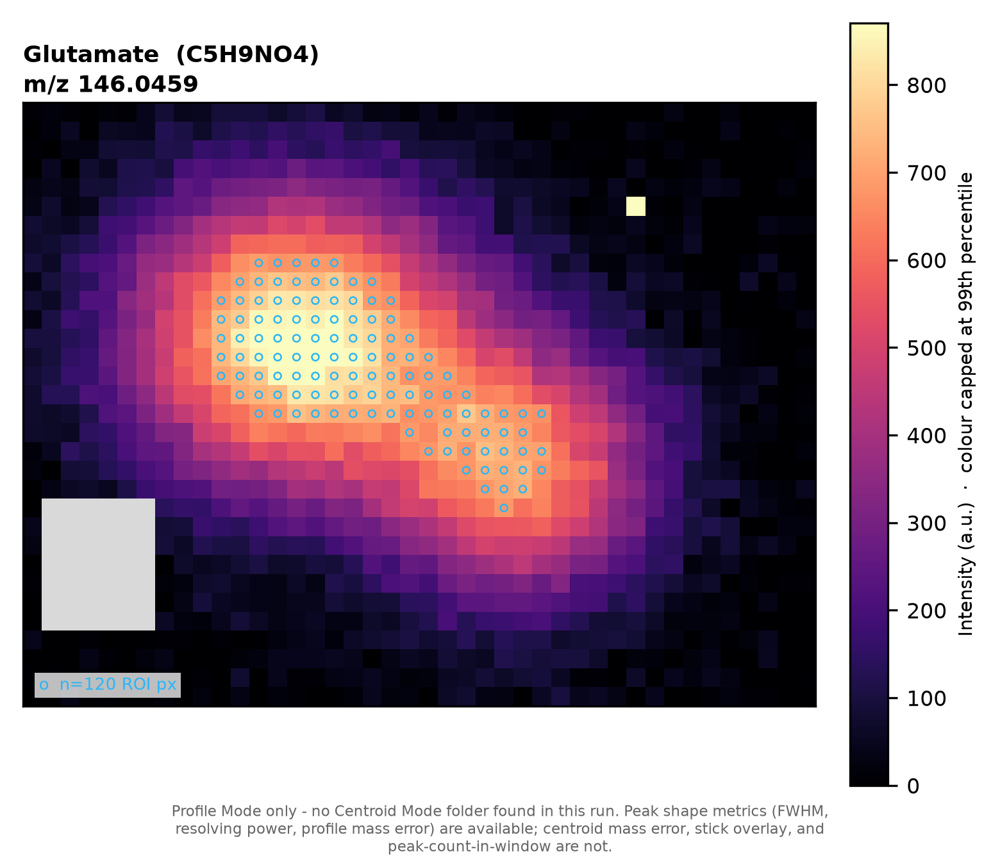

# imzML-peakcheck

Extracts and characterizes specific m/z targets from MALDI mass-spec imaging data. For each target it finds the highest-intensity pixels, averages
their raw profile spectrum and centroided peak list, computes peak-shape
metrics (apex, FWHM, resolving power, mass error, etc.), and produces
figures + a CSV summary.

Runs either from the command line or through a Streamlit GUI.

## 1. Setup

Requires Python 3.10+.

```bash
git clone https://github.com/anderson509chris/imzml-peakcheck.git
cd imzml-peakcheck
python3 -m venv .venv
source .venv/bin/activate        # Windows: .venv\Scripts\activate
pip install -r requirements.txt
```

## 2. Data layout

Point the pipeline at a **run folder**: a directory containing one MSI
acquisition, laid out like this:

```
<run folder>/
    Profile Mode/
        <name>.imzML
        <name>.ibd
    Centroid Mode/
        <name>.imzML
        <name>.ibd
    targets.json          (optional — see below)
```

**Either mode folder alone is enough to process a run.** A folder that's
simply not there is fine — the pipeline runs on whichever mode is present,
with a reduced set of metrics available (see the table below). A folder
that *is* there but unusable (no `.imzML`, more than one `.imzML`, or a
`.imzML` with no matching `.ibd`) is treated as an error, not as "absent" —
the run refuses to process rather than silently dropping half its data.
Each present mode folder must contain exactly one `.imzML` + `.ibd` pair.

Every stage prints a mode banner at the start of a run (and the GUI shows it
as an info/warning box) stating which mode(s) were found and what that costs,
e.g. *"Profile Mode only - no Centroid Mode folder found in this run. Peak
shape metrics (FWHM, resolving power, profile mass error) are available;
centroid mass error, stick overlay, and peak-count-in-window are not."*

| Metric | Needs Profile Mode | Needs Centroid Mode |
|---|:---:|:---:|
| Apex m/z, FWHM, resolving power | ✅ | |
| Profile centroid m/z, profile mass error | ✅ | |
| Area fraction within tolerance window | ✅ | |
| Centroid-mode m/z, centroid mass error | | ✅ |
| Stick overlay, nearest-neighbour peak, peaks-in-window count | | ✅ |
| `n_pixels_above_intensity_floor` | ✅ (or Centroid Mode if Profile Mode absent) | |

When a metric's required mode is missing, its CSV columns are `NaN` and the
row's `warning` column explains why. Profile-side and centroid-side each
distinguish "the mode isn't part of this run" from "the mode is present but
this target has no signal/peak" — `"profile mode not available"` /
`"no profile signal above intensity floor"` / `"centroid mode not available"`
/ `"no centroid peak detected near target"`.

You can also point the pipeline at a **parent folder containing several run
folders** — it auto-discovers every subfolder with a usable `Profile Mode`
and/or `Centroid Mode` subfolder, and processes each one in turn.

## 3. Running the GUI

```bash
source .venv/bin/activate
streamlit run app.py
```

This opens in your browser at `http://localhost:8501`. From there:

1. **Data folder** — type a path, or click **Browse…** to pick one with a
   native folder dialog. Any run folders found are listed with checkboxes.
2. **Target m/z list** — an editable table (add/remove rows) of the m/z
   values to extract, with optional name/formula labels used in the figures
   and CSV. An **Advanced parameters** section exposes top-N pixels, window
   size, grid spacing, and PPM tolerance. Checkboxes below it toggle the
   metrics text box on the spectrum figures and the ROI-pixel circles on the
   ion images.
3. **Run pipeline** — runs all stages for every checked run folder, streaming
   live log output and a progress bar. Each run's `output/` folder is wiped
   first, so results always match exactly the current target list.
4. **Results** — preview images per target, the metrics CSV, a "Download
   PNG" button per image, and a "Download all outputs (.zip)" button per run.

Note: the folder browser and this whole GUI are meant for **local use** —
the server and browser need to be on the same machine.

## 4. Running from the command line

Run every stage for one run folder (or every run folder under a parent
folder):

```bash
python run_pipeline.py "/path/to/run_folder"
python run_pipeline.py "/path/to/parent_folder" --keep-going   # many runs, don't stop on failure
```

Options:

- `--out DIR` — output folder (default `<run_dir>/output`; only applies when
  processing a single run)
- `--targets targets.json` — target list/params to use (default: each run's
  own `<run_dir>/targets.json`, else the built-in defaults)
- `--no-metrics-box` — hide the FWHM/R/peak-count text box on the spectrum figures
- `--no-roi-overlay` — don't circle the top-N ROI pixels on the ion images

Or run individual stages yourself (each also accepts `--out` / `--targets`):

```bash
python pass1.py "<run_dir>" "Profile Mode" prof   # per-pixel intensity at each target
python common.py "<run_dir>"                      # common top-N ROI across all targets
python pass2.py "<run_dir>"                        # per-target top-N ROI
python ionimage.py "<run_dir>"                     # ion images -> Fig_S2_ion_images.png/.pdf
python metrics.py "<run_dir>"                      # peak-shape metrics -> metrics.pkl
python metrics.py "<run_dir>" --common             #   ... -> metrics_common.pkl
python plot.py "<run_dir>"                         # figures + peak_metrics.csv
python plot_c.py "<run_dir>"                       # common-ROI figures + CSV
python plot_cc.py "<run_dir>"                      # common-ROI figures (clean variant)
```

### Ion images

`ionimage.py` renders each target's per-pixel intensity (from pass1's
`peak_<tag>.npy` + `coords_<tag>.pkl`) as a 2D image of the tissue, with the
top-N pixels actually averaged into that target's spectrum outlined on top -
so you can see where on the tissue the reported FWHM and mass error came
from. It only needs pass1's output to run, so it can be run standalone right
after pass1, before pass2/common/metrics.



*(Synthetic example - cyan circles mark the per-target ROI pixels
(`--roi per-target`); the grey block is an unsampled region; the pale square
top-right is a deliberately extreme "hot" pixel that the 99th-percentile
colour clip keeps from washing out the rest of the image.)*

```bash
python ionimage.py "<run_dir>"                             # per-target ROI overlay (default)
python ionimage.py "<run_dir>" --mode cent                  # render Centroid Mode's peak_cent.npy instead
python ionimage.py "<run_dir>" --roi common                 # outline the shared common ROI instead
python ionimage.py "<run_dir>" --roi none                   # no ROI overlay
python ionimage.py "<run_dir>" --vmax-percentile 95         # tighter colour clip (default 99)
python ionimage.py "<run_dir>" --no-roi-legend              # hide the "n=N ROI px" caption
```

Unsampled pixels are left `NaN` (rendered as a distinct grey, not folded into
the colour scale) rather than zero, since a real zero-intensity measurement
is valid data and shouldn't look like "not acquired". The colour scale
defaults to the 99th percentile of above-floor pixel values, not the
maximum, so a single very bright pixel doesn't flatten the rest of the image
into a dark rectangle - the applied percentile is stated in the colorbar
label. Orientation (`origin='upper'`, 1-based `(x, y)`) follows the imzML
coordinate convention and may not match how your acquisition software
displays the same data on screen.

## 5. `targets.json`

Drop this in a run folder to override which m/z values are extracted and how
(otherwise the built-in 4-target default is used). Example:

```json
{
  "sample_name": "My Sample",
  "instrument_desc": "Orbitrap MALDI-MSI, negative ion mode",
  "targets": [
    {"mz": 140.0118, "name": "Phosphoethanolamine", "formula_plain": "C2H8NO4P"},
    {"mz": 146.0459, "name": "Glutamate", "formula_plain": "C5H9NO4"}
  ],
  "params": {"ntop": 100, "halfwin": 0.06, "grid": 1e-5, "ppm": 3.0, "intensity_floor": 0.0}
}
```

- `targets` — list of m/z values to extract. `name`/`formula_plain` are only
  used for figure labels and the CSV; `mz` is required.
- `params.ntop` — number of highest-intensity pixels averaged per target.
- `params.halfwin` — half-width (Da) of the profile spectrum window plotted/extracted around each target.
- `params.grid` — resampling grid spacing (Da) for averaging profile spectra.
- `params.ppm` — tolerance (ppm) used throughout (pass1 peak detection, `metrics.py` integration window, plot gold band).
- `params.intensity_floor` — raw-intensity counts a pixel must exceed to count toward top-N selection and the CSV's `n_pixels_above_intensity_floor` column. Default `0` (any nonzero signal counts); raise it to your instrument's noise floor so absent targets show as absent (NaN metrics, `warning` column set) instead of an averaged noise spectrum that looks like real data.

## 6. Output

Everything lands in `<run_dir>/output/`:

| File | Contents |
|---|---|
| `Fig_S1_profile_vs_centroid.png/pdf` | Combined figure, one panel per target, per-target top-N ROI |
| `Fig_S1b_common_ROI.png/pdf` | Same, but one common ROI shared across all targets |
| `Fig_S1c_common_ROI_clean.png/pdf` | Common-ROI figure, no metrics text box |
| `Fig_S2_ion_images.png/pdf` | Combined ion-image figure, one panel per target, with ROI overlay |
| `spectrum_mz*.png`, `commonROI_mz*.png`, `commonROIclean_mz*.png`, `ion_image_mz*.png` | Individual per-target panels |
| `peak_metrics*.csv` | Apex m/z, FWHM, resolving power, mass error, etc. per target |
| `spectra*.pkl`, `metrics*.pkl`, `peak_prof.npy`, `peak_cent.npy`, `coords_prof.pkl`, `coords_cent.pkl`, `common_pixels.pkl` | Intermediate data, re-used by later stages (`peak_prof.npy`/`peak_cent.npy` only exist for modes actually present) |

## 7. Tests

```bash
source .venv/bin/activate
python3 -m unittest discover -s tests -v
```

Covers profile-only, centroid-only, and both-modes runs against small
hand-written synthetic `.imzML`/`.ibd` fixtures (`tests/imzml_fixtures.py`,
no extra dependencies), checking that each completes, that `NaN` shows up in
exactly the fields that mode is missing, that a present-but-broken mode
folder raises instead of silently degrading, and that both 32-bit and
64-bit `.imzML` precision are read correctly.
